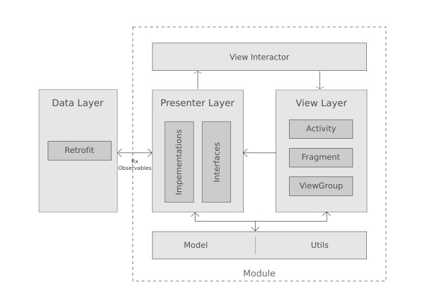

# Android MVP

This sample Android app showcases a simple implementation of Model-View-Presenter architectural pattern. It is intended as a reference for a fully online android app, so some of the layers (like local db and caching) usually present in other MVP references are avoided to make it as simple as possible.
It uses [Dagger 2](https://google.github.io/dagger/) for dependency injection and [Retrofit 2](https://square.github.io/retrofit/) for doing network calls along with [RxJava/RxAndroid](https://github.com/ReactiveX/RxAndroid)

## Architecture



This app follows MVP architectural pattern, which include following layer and components

* __View Layer__: Activities, Fragments and other standard Android UI components belongs here. This layer will communicate with presenter through interfaces based on user interactions and shows data provided by presenter.

* __Presenter__: Presenters will obtain RxObservable from data layer (Retrofit) and subscribe for the changes, once the changes happen it will inform the views through `ViewInteracor` interfaces.

* __Model__: this layer will define the business models used through out the app.

* __View Interactor__: this set of interfaces define how a presenter should communicate with the views

* __Utils__: A set of classes which provides some helper or utility function through out the app like `PreferenceUtil` for dealing with shared preferences.

* __Data Layer__: For a fully online app, this layer include retrofit services. this will provide `RxObservable` to the presenter during a network call, so the presenter can observe that and call appropriate view interactor methods on receiving response as the result.

* __Module__: Module consist classes from all layers which are related to one particular feature of the app like `login` and `task`. A `common` module is defined to hold classes which will be commonly used across other modules.

## Libraries used

- [Dagger 2](http://google.github.io/dagger/)
- [Retrofit 2](http://square.github.io/retrofit/)
- [RxJava](https://github.com/ReactiveX/RxJava) and [RxAndroid](https://github.com/ReactiveX/RxAndroid) 
- [Android support libraries: Appcompat, design, recyclerview](https://developer.android.com/topic/libraries/support-library/index.html)
- [Butterknife](https://github.com/JakeWharton/butterknife)
- [Timber](https://github.com/JakeWharton/timber)

## See also

- [Google Android architecture samples] (https://github.com/googlesamples/android-architecture)
- [Ribot's Android boilerplate] (https://github.com/ribot/android-boilerplate)
- [Android clean architecture] (https://github.com/android10/Android-CleanArchitecture)
- [Flux architecture for Android] (https://github.com/lgvalle/android-flux-todo-app)


## License
```
 Copyright 2016, Farhan Ali

   Licensed under the Apache License, Version 2.0 (the "License");
   you may not use this file except in compliance with the License.
   You may obtain a copy of the License at

       http://www.apache.org/licenses/LICENSE-2.0

   Unless required by applicable law or agreed to in writing, software
   distributed under the License is distributed on an "AS IS" BASIS,
   WITHOUT WARRANTIES OR CONDITIONS OF ANY KIND, either express or implied.
   See the License for the specific language governing permissions and
   limitations under the License.
```
